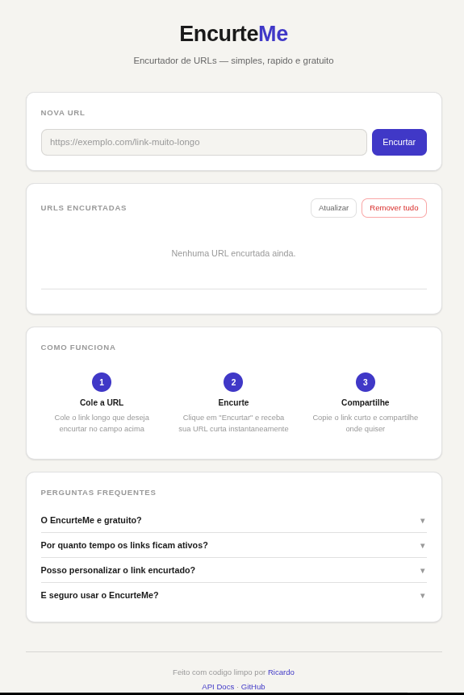
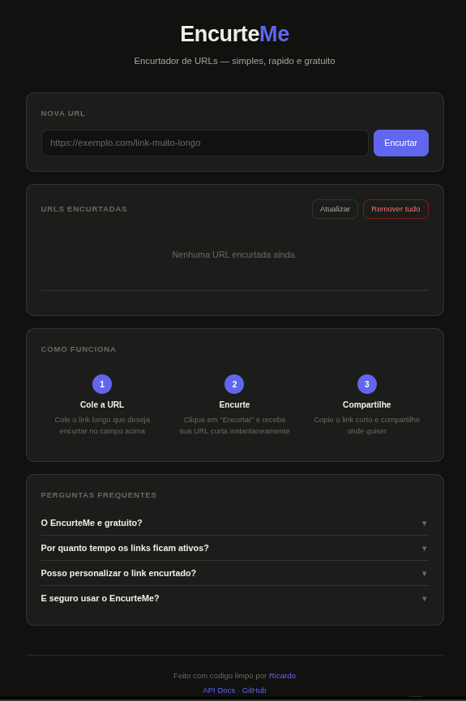

# EncurteMe

Encurtador de URLs gratuito, rapido e sem complicacao. Cole um link longo, receba uma URL curta instantaneamente e compartilhe onde quiser.

**Acesso publico:** [http://163.176.255.7:8080](http://163.176.255.7:8080)

<div align="center">
  
  <br/>
  <em>Interface principal — modo claro</em>
</div>

<br/>

<div align="center">
  
  <br/>
  <em>Interface principal — modo escuro</em>
</div>

---

## Tecnologias

| Camada | Tecnologia |
|---|---|
| **Backend** | Java 21, Spring Boot 4.0.2 |
| **Banco de Dados** | PostgreSQL 15 |
| **ORM** | Spring Data JPA + Hibernate 7.2 |
| **Mapeamento** | MapStruct 1.5.5 |
| **Documentacao** | SpringDoc OpenAPI (Swagger UI) |
| **Frontend** | HTML5, CSS3, Vanilla JavaScript |
| **Build** | Maven |

## Arquitetura

O projeto segue a **Arquitetura Hexagonal (Ports and Adapters)**, separando regras de negocio de frameworks e infraestrutura:

```
src/main/java/br/com/encurteMe/
├── domain/                    # Core — models e excecoes de dominio
│   ├── model/Url.java
│   └── exception/
├── application/               # Casos de uso (regras de aplicacao)
│   ├── port/in/               # Input ports (interfaces de uso)
│   ├── port/out/              # Output ports (interfaces de repositorio)
│   └── service/               # Implementacoes dos casos de uso
├── adapter/                   # Adaptadores para o mundo externo
│   ├── web/                   # Controller, DTOs, mappers, exception handler
│   └── persistence/           # Entities, JPA repositories, mappers
└── config/                    # Configuracao de beans Spring
```

## Funcionalidades

- Encurtamento de URLs com codigo aleatorio de 5 caracteres
- Redirecionamento 302 com contador de cliques
- Listagem paginada de URLs encurtadas
- Exclusao em lote de todos os registros
- Interface web responsiva com dark mode automatico
- Documentacao interativa via Swagger UI
- Protecao contra colisao de codigos (retry automatico)
- Tratamento centralizado de erros (RFC 7807 ProblemDetail)

## Como Rodar Localmente

### Pre-requisitos

- Java 21+
- Maven 3.6+
- PostgreSQL

### 1. Configurar banco de dados

Crie um banco PostgreSQL e configure as variaveis de ambiente:

```env
DB_URL=jdbc:postgresql://localhost:5432/encurteme
DB_USERNAME=seu_usuario
DB_PASSWORD=sua_senha
SERVER_PORT=8080
APP_BASE_URL=http://localhost:8080
```

### 2. Compilar

```bash
mvn clean package -DskipTests
```

### 3. Executar

```bash
java -jar target/EncurteMe-0.0.1-SNAPSHOT.jar
```

A aplicacao estara disponivel em `http://localhost:8080`.

## Endpoints da API

| Metodo | Path | Descricao |
|---|---|---|
| `POST` | `/api/shortener` | Cria uma URL encurtada |
| `GET` | `/api/{codigo}` | Redireciona para a URL original (302) |
| `GET` | `/api/list?page=0&size=10` | Lista URLs paginadas (max size: 100) |
| `DELETE` | `/api/remove` | Remove todos os registros |
| `GET` | `/swagger-ui` | Documentacao interativa |

## Deploy na VPS

A aplicacao roda como servico systemd em uma Oracle Cloud VPS (Ubuntu 22.04, 1GB RAM) com PostgreSQL em Docker:

```ini
[Unit]
Description=API EncurteMe
After=syslog.target network.target

[Service]
User=ubuntu
WorkingDirectory=/home/ubuntu
ExecStart=/usr/bin/java -Xmx256m -Xms128m -XX:+UseSerialGC \
  -jar /home/ubuntu/EncurteMe-0.0.1.jar
EnvironmentFile=/home/ubuntu/.env
Restart=always
RestartSec=10

[Install]
WantedBy=multi-user.target
```

## Autor

**Luis Ricardo Laranjeira Vieira**

- GitHub: [@KingDanone](https://github.com/KingDanone)
- Email: lricardolv10@gmail.com

## Licenca

Este projeto esta sob a licenca MIT — veja o arquivo [LICENSE](LICENSE) para detalhes.
